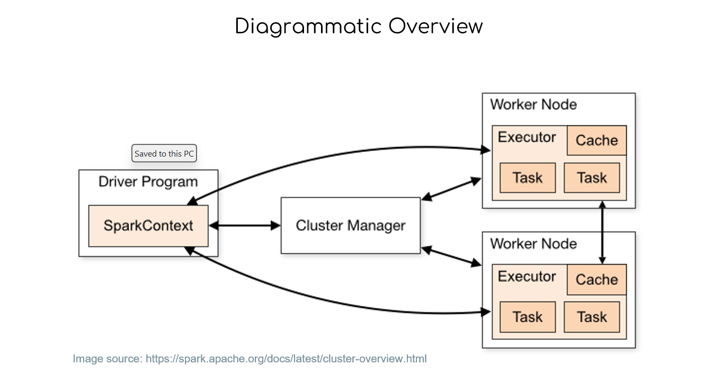
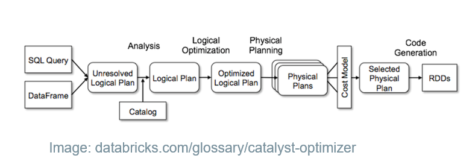
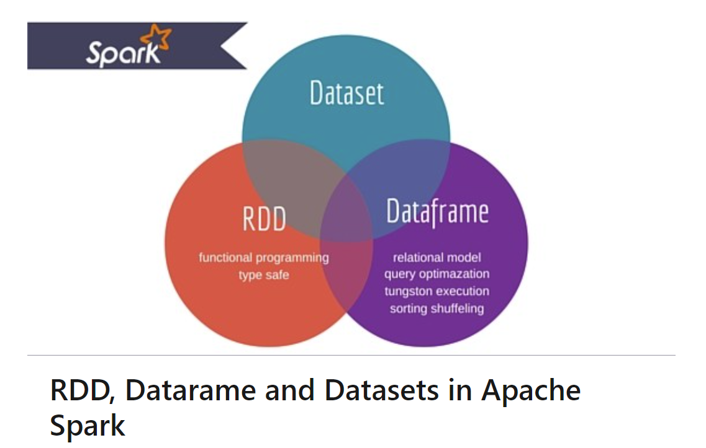

# DataEngineering-Spark-1
Hands-On Real Time PySpark Project

## Project Description

Overview

Apache Spark is an open-source, distributed computing framework designed for processing and analyzing large-scale datasets. It provides a unified engine that supports various data processing tasks, including batch processing, interactive queries, streaming, machine learning, and graph processing. Spark is implemented in Scala and offers APIs in Scala, Java, Python (PySpark), and R (SparkR).

PySpark is a powerful open-source framework for distributed data processing and analysis. It provides a Python API for Apache Spark, which is a fast and general-purpose cluster computing system. Here are some reasons why PySpark is widely used:

Big Data Processing: PySpark is designed for processing large-scale datasets, making it suitable for big data analytics. It can handle data volumes that exceed the memory capacity of a single machine by distributing the processing across a cluster of machines.

Speed and Performance: Spark is known for its speed and efficiency in processing data. It performs in-memory computations, which allows for faster processing compared to traditional disk-based processing frameworks. Additionally, PySpark leverages the distributed computing capabilities of Spark, enabling parallel processing across multiple machines, further enhancing performance.

Fault Tolerance and Scalability: Spark provides fault tolerance by automatically recovering from failures. If a node fails during processing, Spark can reroute the tasks to other available nodes, ensuring uninterrupted data processing. Moreover, PySpark allows you to scale your analysis as your data grows. You can easily add more machines to your Spark cluster to handle increasing data volumes without significant code changes.

Easy Integration with Python Ecosystem: PySpark provides a Python API, allowing data scientists and Python developers to leverage the powerful capabilities of Spark while using familiar Python syntax. It integrates seamlessly with popular Python libraries such as NumPy, Pandas, and scikit-learn, enabling efficient data manipulation and analysis.

Advanced Analytics: PySpark supports a wide range of data processing and analysis tasks, including batch processing, interactive queries, machine learning, and graph processing. It provides high-level APIs for these tasks, making it easier to write complex data processing pipelines and analytical workflows.

Community and Ecosystem: Spark has a large and active community, which means there are abundant resources, tutorials, and documentation available online. This community-driven ecosystem also contributes to the development of various Spark libraries and extensions, providing additional functionalities and integration options.

## Spark Architecture

## Spark Workflow

 

## Aim:

A crucial aspect of this project involves comprehending the life cycle of Spark applications, enabling us to navigate through the entire process with ease. will dive into the intricacies of RDD (Resilient Distributed Datasets), an essential data structure in Spark, understanding its purpose and practical implementation. Furthermore, will explore DataFrames, an advanced data abstraction in PySpark, and leverage its capabilities for efficient data manipulation and analysis.

Spark SQL, a powerful component of Spark, will also be covered extensively. will delve into its features and functionality, enabling us to execute SQL-like queries on distributed datasets. This knowledge will empower us to perform relational data processing tasks seamlessly within the Spark environment.
 

## Data Description:

The TLC (Taxi and Limousine Commission) Trip Record Data refers to a dataset that contains detailed information about taxi trips in New York City. This dataset is made available by the TLC, which regulates and oversees the taxi and for-hire vehicle industry in the city.

The TLC Trip Record Data includes various attributes for each taxi trip, such as the pickup and drop-off locations, trip distance, trip duration, fare amount, payment type, and additional surcharges. It also provides information about the taxi's unique identifier, driver details, and other relevant trip-related information.

The dataset is often used for a wide range of purposes, including transportation analysis, urban planning, predictive modeling, fare optimization, and studying travel patterns in the city. Researchers, data scientists, and analysts can leverage this dataset to gain insights into taxi usage, passenger behavior, and transportation trends.

Analyzing the TLC Trip Record Data typically involves processing and cleaning the dataset, performing exploratory data analysis, and applying various statistical and machine learning techniques to derive meaningful insights. The large volume and complexity of the dataset often require tools and frameworks like PySpark or Apache Spark for efficient data processing and analysis.

Access to the TLC Trip Record Data allows for a deeper understanding of taxi operations and transportation dynamics in New York City, enabling data-driven decision-making and improvements in the transportation system.

### Dataset Used

Data Source: (https://www.nyc.gov/site/tlc/about/tlc-trip-record-data.page)

## Tech Stack

➔ Language: Python, SQL

➔ Package: PySpark

 

## PySpark:

PySpark is a Python interface for Apache Spark. It not only lets you develop Spark applications using Python APIs, but it also includes the PySpark shell for interactively examining data in a distributed context. PySpark supports most of Spark's capabilities, including Spark SQL, DataFrame, Streaming, MLlib, and Spark Core. In this project, you will learn about core Spark architecture, Spark Sessions, Transformation, Actions, and Optimization Techniques using PySpark.

## RDD VS DATAFRAME VS DATASET

Here is the Data Analysis:

[lab_1_notebook.ipynb](https://github.com/Raghuraj-DataEngineer/DataEngineering-Spark-1/blob/main/lab_1_notebook.ipynb)

[lab_2_notebook.ipynb](https://github.com/Raghuraj-DataEngineer/DataEngineering-Spark-1/blob/main/lab_2_notebook.ipynb)

[lab_3_notebook.ipynb](https://github.com/Raghuraj-DataEngineer/DataEngineering-Spark-1/blob/main/lab_3_notebook.ipynb)

[lab_4_notebook.ipynb](https://github.com/Raghuraj-DataEngineer/DataEngineering-Spark-1/blob/main/lab_4_notebook.ipynb)

[lab_5_notebook.ipynb](https://github.com/Raghuraj-DataEngineer/DataEngineering-Spark-1/blob/main/lab_5_notebook.ipynb) 

